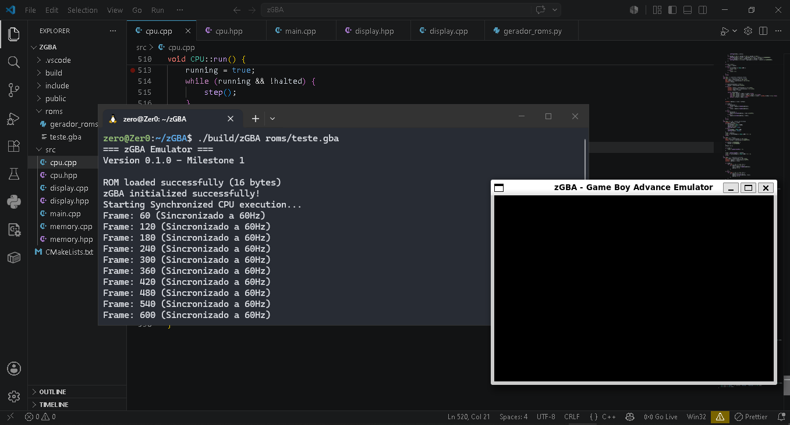

# 🎮 zGBA — Game Boy Advance Emulator


**zGBA** é um emulador de Game Boy Advance desenvolvido em C++17 com foco em baixo nível, modularidade e performance. O projeto conta com execução dual de instruções **ARM7TDMI (ARM/THUMB)**, decodificação/renderização via **SDL2** e suporte híbrido a **BIOS Real e BIOS HLE** (High-Level Emulation).

---

## 📸 Screenshots

<p align="center">
  
</p>

---

## 🛠️ Funcionalidades & Arquitetura

- **Núcleo CPU (ARM7TDMI):**
  - Decodificação e execução dos conjuntos de instruções **ARM** (32-bit) e **THUMB** (16-bit).
  - Suporte completo a alternância de modos de operação (`SVC`, `IRQ`, `FIQ`, `SYS`, `USER`).
  - Suporte a interrupções via hardware (`VBlank`, `IE`, `IF`).
  - Troca de estados dinâmica via `BX` e tratamento de subrotinas via `BL`/`BLX`.

- **Subsistema de Memória:**
  - Mapeamento preciso da memória do GBA (EWRAM 256KB, IWRAM 32KB, VRAM 96KB, OAM, Palette RAM e ROM até 32MB).
  - Suporte a acessos desalinhados e barramento de dados 8, 16 e 32 bits.
  - Suporte a **BIOS HLE** para chamadas de sistema (SWI) comuns ou carregamento opcional de `bios.bin` oficial.

- **Processador Gráfico (PPU/Display):**
  - Renderização acelerada via **SDL2**.
  - Suporte a renderização de mapas de *Background* (Tiles de 8x8 pixels em 4bpp/8bpp) e *Sprites* (OAM).
  - Decodificação de paleta de cores BGR555 com conversão para ARGB8888.

---

## 📁 Estrutura do Projeto

```text
zGBA/
├── CMakeLists.txt        # Configuração de compilação CMake
├── docs/                 # Documentação e roadmap do projeto
│   └── MapaDesenvolvimento.md
├── public/               # Capturas de tela e assets
├── roms/                 # ROMs para desenvolvimento e testes
│   ├── bios.bin          # (Opcional) BIOS oficial do GBA
│   └── teste.gba
└── src/                  # Código-fonte do emulador
    ├── cpu.cpp / .hpp    # Emulação do processador ARM7TDMI
    ├── memory.cpp / .hpp # Mapeamento e barramento de memória
    ├── display.cpp / .hpp# Engine gráfica e gerenciamento SDL2
    └── main.cpp          # Loop principal e entrada da aplicação

```

---

## 🚀 Como Compilar e Executar

### Pré-requisitos

Certifique-se de ter os seguintes pacotes instalados no seu sistema (Linux/WSL/MSYS2):

* **GCC / Clang** com suporte a C++17
* **CMake** (v3.16 ou superior)
* **Make** ou **Ninja**
* Biblioteca de desenvolvimento **SDL2** (`libsdl2-dev`)

No Ubuntu/Debian/WSL:

```bash
sudo apt update
sudo apt install build-essential cmake libsdl2-dev

```

---

### Passos de Compilação

1. **Clone o repositório:**
```bash
git clone https://github.com/Zer0G0ld/zGBA.git
cd zGBA

```


2. **Crie o diretório de build e compile:**
```bash
mkdir build && cd build
cmake ..
make -j$(nproc)

```


3. **Executando o emulador:**
```bash
./zGBA ../roms/teste.gba

```

---

## 🕹️ Teclas e Controles

*(Ajuste conforme os mapeamentos do seu `main.cpp` / `display.cpp`)*

| Botão GBA | Tecla Teclado |
| --- | --- |
| **D-Pad** | Setas (Direcionais) |
| **Botão A** | `Z` |
| **Botão B** | `X` |
| **L / R** | `A` / `S` |
| **Start** | `Enter` |
| **Select** | `Backspace` ou `Shift` |

---

## 🗺️ Roadmap de Desenvolvimento

Para detalhes sobre o estado atual do desenvolvimento e as próximas etapas do projeto, consulte a documentação dedicada em [`docs/MapaDesenvolvimento.md`](https://www.google.com/search?q=docs/MapaDesenvolvimento.md).

* [x] Decodificação base do pipeline ARM/THUMB
* [x] Barramento de memória e HLE SWI
* [x] Motor de vídeo básico (Mode 0 / BG Tiles)
* [ ] Suporte completo a Sprites (OAM) e Modos de Vídeo Affine (Modes 1-5)
* [ ] Implementação do subsistema de Áudio (APU - Direct Sound & Square Waves)
* [ ] Suporte a Saves (SRAM, EEPROM, Flash)

---

## 📜 Licença

Distribuído sob a licença **GPLv3**. Veja o arquivo `LICENSE` para mais informações.
